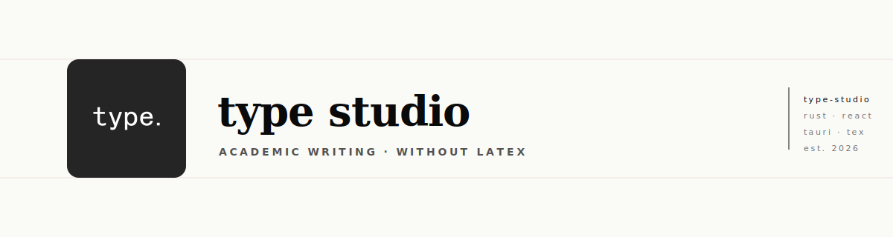

<picture>
  <source media="(prefers-color-scheme: dark)" srcset="./assets/banner-dark.svg">
  
</picture>

 

 

 

## A writing studio for researchers

We build tools that let academics write in a visual editor and get publication-quality documents — without learning a markup language. The author focuses on their ideas; the software handles the rest.

 

<picture>
  <source media="(prefers-color-scheme: dark)" srcset="./assets/divider.svg">
  
</picture>

 

## What we make

<table>
<tr>
<td valign="top">

### [type](https://github.com/type-studio/type)

A desktop writing application for researchers and academics. Compose in a familiar visual editor and produce polished, submission-ready documents — no markup language required.

</td>
</tr>
</table>

 

<picture>
  <source media="(prefers-color-scheme: dark)" srcset="./assets/divider.svg">
  
</picture>

 

## Get involved

<table>
<tr>
<td align="center" width="33%">

### 📦
**[Install](https://github.com/type-studio/type/releases)**

Download binaries for Linux, macOS, and Windows.

</td>
<td align="center" width="33%">

### 💬
**[Issues](https://github.com/type-studio/type/issues)**

Bug reports, feature requests, and feedback.

</td>
<td align="center" width="33%">

### 🤝
**[Licensing](https://github.com/type-studio/type/issues)**

Partnership, institutional licensing, and commercial deployment.

</td>
</tr>
</table>

 

Copyright © 2026 type studio · All rights reserved

